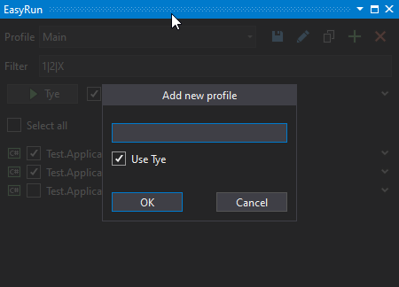
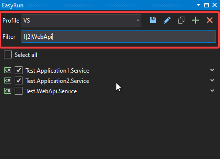
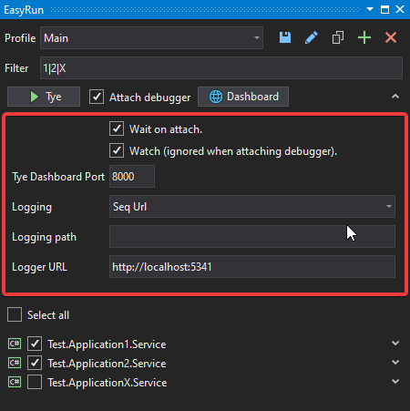

# EasyRun

This extension makes it easy to run and debug microservices using Tye or
multiple startup projects in Visual Studio.

Download this extension from the [VS Gallery](https://marketplace.visualstudio.com/items?itemName=BrianVraamark.EasyRun)

# Prerequisites

If you want to use Tye to run and debug your application, you need a few things
in your development environment.

### Tye

Project Tye is the key component to get everything working. Install the latest
version by following the guide on <https://github.com/dotnet/tye/blob/main/docs/getting_started.md>

### .NET Core 3.1

Did you remember to install .NET core 3.1 when you followed the Tye installation guide?

### Docker

Tye requires Docker installed. You can download and install Docker from <https://docs.docker.com/get-docker>

# Features

-   Run and Debug projects in Visual Studio
-   Multiple profiles with different configurations.
-   Auto-generate temporary Tye YAML file outside your Git Repository.
-   Use encrypted Secret Environment Variables (e.g., ConnectionString and password) outside your Git Repository.
-   Auto attaches Visual Studio debugger when you run your projects.
-   RegEx filter to include/exclude pårojects.

# Profiles

There are two different profiles you can use. Tye and Visual Studio. You can
choose which one when you create or edit a profile.

## Profile settings file and secrets

All profiles are stored in a file named `<solution-name>.EasyRun.json` in the
same folder as your solution file.

Secret Environment Variables is not stored in that file. Instead, they live in
the `%AppData%/EasyRun` folder and are encrypted. Secrets are only exposed in the
`%Temp%/EasyRun` folder when Tye runs and gets deleted again when Tye stops.

## Visual Studio Profiles

The first section defines your profiles and the RegEx project filter. There is
no dedicated button for running your projects. Just do as you always do after
selecting one or multiple projects.

## Tye Profiles

For Tye, you have a few extra options.

For each Profile, you can:
-   Start and stop Tye.
-   Auto Attach the debugger.
-   Launch the Tye Dashboard.

## Tye profile configuration

Each Tye profile has a set of options.

#### Wait on attach

If you check `Wait on attach` Tye will halt running the service until the
debugger is attached to the process.

#### Watch

If you check `Watch` Tye will restart your service if you make any code
changes.

#### Tye Dashboard port

You can set the Tye Dashboard port. Selecting a different port can be helpful if
you have Visual Studio opened more the once.

#### Logging

When selecting logging, you can choose between two types – with or without URL.
- When selecting a type **with URL**, you have to specify an URL to an existing
running logger (remote or local).

- If you select a type **without URL**, Tye will create or reuse a container in
Docker. What container depends on the logging type you choose.

## Tye service configuration

For each Tye service, the following options can be set.

#### Bindings

Each service can have one or more bindings. You define each binding on a
separate line. The binding format is `[name]:[protocol]:<port>`.

Name is optional if you only define one binding. You can then use the format
`::<port>`. Protocol is always optional.

#### Arguments

Here you can define command-line arguments to the service.

#### Env. Variables

Here you can define environment variables for the service. You define each
variable as a key/value pair on a separate line. The key and the value has to be
separated på an equal sign.

#### Secret Variables

You define Secret Environment Variables like normal variables. The only
difference is that you have to click on the edit (pen) button to see and change
them.

#### Replicas

Here you can define how many replicas (instances) of the service you want to run
simultaneously.

## To-Do's

-   Add Docker images to run with Tye.
-   Add binary files to run with Tye.
-   Launch configuration when running Visual Studio multi startup projects.
-   Support even more Tye features.
-   Add sourcecode to GitHub.
